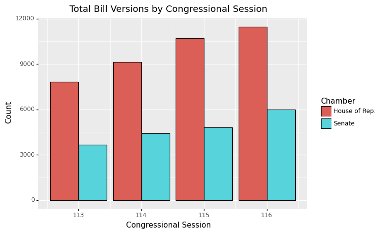
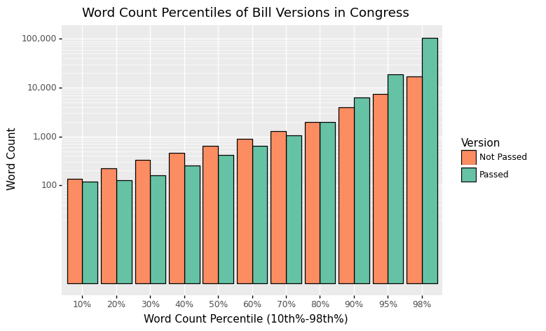
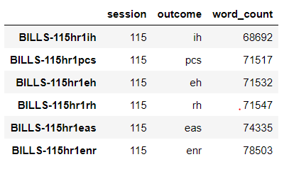
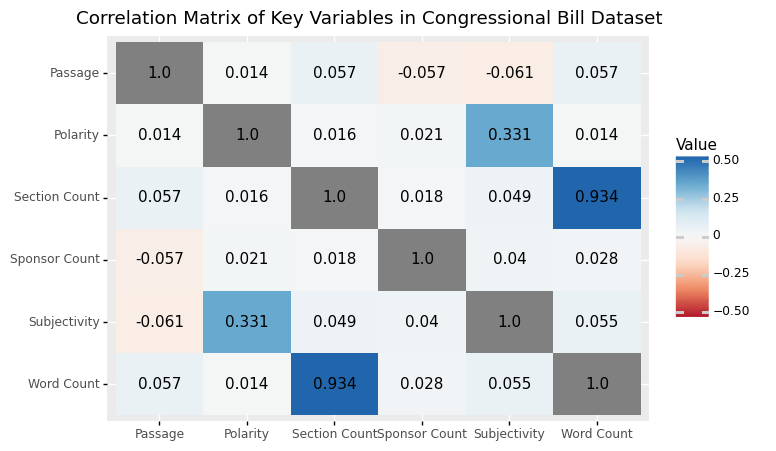

# Predicting Congressional Bill Outcomes using Machine Learning and Large-Scale Computing Methods

## Team members:
James Midkiff 
Michelle Orden 
Kelly Yang 

## Introduction

The United States is becoming more politically divided over time, making it more difficult for legislation to gain enough votes to pass and eventually become law. A major factor of whether or not a given bill passes can be attributed to a number of variables outside of the bills itself, such as which party holds majority power at the time of vote and which session of Congress is active at the time the bill is introduced. The passage of a congressional bill is also influenced by characteristics of the text of the bill itself, such as how many words are contained in the bill, the number of sections in the bill, and the number of sponsors the bill has. In this project, our group explores how features related to a given bill determine whether or not a bill passes or fails. We do so using a Logistic Regression model, as well as Large-Scale Computing tools such as PySpark, AWS EMR clusters, and AWS S3 buckets.

## Domain Knowledge

To give some context to the U.S. legislative process, a bill goes through a long process between being introduced in Congress to becoming law. A very small subset of bills introduced in Congress receive a vote, and fewer bills become law. In the most recent Congress (116th) which ranged from January 3rd, 2019 to January 3rd, 2021, 16,601 bills and resolutions were introduced and proposed to Congress. Of those, only 746 (4%) were voted on, and 344 (2%) were enacted as laws. Our goal is to capture what language/features predict whether or not a bill warrants being passed into law. With such a small percentage of introduced bills ever becoming law, this information could potentially inform members of the House and Senate on how to make their bill of interest more likely to receive a vote and eventually pass.

## Data

All data for this project was stored in an AWS S3 bucket. The code to set up the bucket can be found in the following notebook: https://github.com/morden35/Bill_NLP_LargeScale/blob/master/s3_set_up.ipynb.

Our datasource for this project is https://www.govinfo.gov/. Our initial approach was to collect all bills from this source using their API (https://api.govinfo.gov/docs/). In order to do so, we needed to make 2 separate API calls for each bill. First, in order to identify a bill, we needed to collect the each bill's 'packageId'. Once we had the 'packageId' for a given bill, we could then make a second API call to collect the bill summary and text. We then collected all 'packageId's and their associated bill texts and stored them in a dictionary, which was then stored in an AWS S3 bucket. The code for this process can be found in the following notebook: https://github.com/morden35/Bill_NLP_LargeScale/blob/master/get_bills.ipynb. We were able to successfully run this notebook on an EMR cluster using 3 m5.xlarge EC2 instances. This allowed us to speed up a very slow data gathering process. Although this notebook worked as expected, we ran into issues with the API due to throttling. The API allows a maximum of 1000 requests per hour for a given API key. With the amount of API requests necessary to gather the data of interest, we had to think of an alternative way to collect the bill texts.

Fortunately, our datasource has a Bulk Data Repository (https://www.govinfo.gov/bulkdata). We were able to download zip files containing all bill texts for the 113th-116th Congress in xml format. We then directly uploaded these xml files to the S3 bucket. In order to make this data easier to pull into Dask, we converted the xml files to a dictionary/json representation. To do so, we connected to the S3 bucket via boto3 in a notebook that ran on an EMR cluster. This EMR cluster only required 1 m4.xlarge EC2 instance. We then iterated through each xml file and decoded the file into a utf8 string. All bill text strings were then added to a dictionary, and pushed back to the S3 bucket for storage. The code for this process can be found in the following notebook: https://github.com/morden35/Bill_NLP_LargeScale/blob/master/convert_xml.ipynb.

Additionally, we decided to keep only House and Senate bills, and filter our resolutions. Ultimately, we were able to collect all House and Senate bill texts from the 113th (11,479 bills), 114th (13,541 bills), 115th (15,527 bills), and 116th (17,452 bills) congress, which spans from January 3rd, 2013 to January 3, 2021. This accumulated to a total of 57,999 bill texts. In future iterations of this project, we would like to complete the analysis using all available bill texts (available bill texts date back to the 103rd Congress, which began on January 5th, 1993).

## Natural Language Processing
In this section, we create and analyze various features using the text of the bills themselves. When we say "bills", we also refer to each different version of a bill as a separate bill because the text of a bill changes over time, and we are interested in the text that is in the version of bill that is ultimately passed. Due to the amending process we believe that the text in a bill influences whether or not a bill is passed, and thus it makes sense to consider as "failed" early versions of a bill that is ultimately enacted. 

In the `serial_nlp.py` file, we generate the following features via text parsing (regular expressions): 
* sponsor_count - A count of the total number of congressional sponsors of the bill
* section_count - A count of the number of 'sections' of the bill and 'sections' of other bills that the bill in question amends
* word_count - The number of total words in the bill itself

And we import several functions from the `textblob` natural language processing Python module: 
* subjectivity - A measure of how 'subjective' or 'objective' the text is
* polarity - A measure of how 'positive' or 'negative' the text is

We then visualized these text features and note several interesting observations:  

In our dataset, the number of bills has increased over time, with the Senate generally having about one-half of the bills that the House of Representatives does.  

  

 
 
Nonetheless, both chambers of Congress exhibit remarkable similarity in terms of the bill outcomes. Only about 2% of bills from each Chamber are passed in any given session.  

  

 
 
We use these features and others described later to predict which bills and bill verions have been "Passed" by Congress -- those whose status is 'enrolled' -- vs. all other bills, which we consider to be "Not Passed".  

Arranging "Passed" and "Not Passed" bills by their total word count, we find that "Passed" bills generally have a lower word count than "Not Passed" bills up through the 80th percentile of each type. Beyond this point, however, "Passed" bills begin expponentially surpassing "Not Passed" bills in word count.  

   

We speculate a couple possible reasons for this: 
* Uncontroversial bills may concern minutae that do not require lengthy laws to address, such as from the 113th Session HR1071 "An Act To specify the size of the precious-metal blanks that will be used in the production of the National Baseball Hall of Fame commemorative coins.", which has a word count of 102. 
* Highly public and debated legislation may require more concessions, amendments, and "pork" that add to the bill's overall length in order for passage to occur. For example, the 2017 Tax Cuts and Jobs Act (a.k.a. the Trump Tax Cuts), HR1 from the 115th Session of Congress increased notably in size between its introduction in the house, to its eventual enactment (see the help files https://www.govinfo.gov/help/bills for a list of abbreviations for bill outcomes):  

    

 
 
Here we explore the correlation between our textual features. As could perhaps be expected, there is near perfect correlation between increasing the number of sections in a congressional bill and the total word count. Most other features are not closely related to each other, except for the polarity and subjectivity scores, which have a mildly positive correlation.  

  

While we first attempted to use Dask on the University of Chicago Midway2 computing system in `Old/nlp.py` so as to exploit data parallelization, for several reasons it proved far more practical to perform the Natural Language Processing in a serial format:  
1. Despite signifcant debugging, Dask was unable to read json files directly from S3, so we were forced to read the data in a non-distributed format via Pandas
2. The AWS starter accounts are unable to launch EMR cluster notebooks
3. The data was text-based and stored in dataframes (rather than numeric and stored in Numpy arrays), so MPI parallelization would struggle to work with it. 
4. The dataset was small enough (approx. 2Gb) that Pandas was still capable of holding everything in memory. 

It was disappointing to find that parallelizaton was not practical here, but an important part of parallel computing is knowing when it is not worthwhile. 

## Machine Learning on EMR using PySpark

Once we had the bill data and the congress data available to us in our S3 bucket, we began by loading it in on AWS Console through EMR. This was done by creating an EMR Cluster and then creating the notebook. For the following, please refer to the spark_bill_ml.ipynb Notebook which ran the following model on EMR.

After reading in the data and consolidating it into a dataframe, we then converted it from Pandas to a PySpark dataframe. As we have learned, PySpark gives us the capacity to run machine learning models on multiple machines, as opposed to Pandas which only runs on a single machine. Specifically, PySpark has the capacity to run on multiple nodes, which is important when dealing with large datasets. Although we could have done the project in Pandas, doing it in PySpark allows us to run our model more efficiently and also gives us the ability to scale up our model as needed with additional data.

Our final consolidated PySpark dataframe consisted of 58011 rows and 17 columns. Out of these 17 columns, we wanted to narrow down the features that we would use to predict whether or not a bill will be passed. In accordance with the group, we decided on the following features:\
['sponsor_count', 'section_count', 'word_count_scaled', 'subjectivity', 'polarity', '% Democrat', '% Republican']\
We originally planned on using original word_count as a feature, but noticed that the word counts of various bills introduced to Congress had extremely high variance. Therefore, we decided it would be more optimal to run the word_count through a Standard Scaler to normalize the column into a scaled version that we then could pass on as a feature into our ML model. Sponsor count and section count were not normalized since they had far less variance, and because the nature of these features made more sense to keep it as is. For instance, we want to know how each additional bill sponsor affects the likelihood of the outcome. Polarity and Subjectivity scores are two continuous variables that were taken from the previously conducted NLP Sentiment Analysis. And % Democrat and % Republican represent the political makeup of Congress. These 7 continuous features in total will be used to drive our model to use past historical bill data to inform on future bill passage. 

A number of regression and classification models were considered when deciding on the overlay of the project. Given our scope, and our desired outcome, we settled on using Multivariate Logistic Regression to create our model. This was the ideal model for a number of reasons. First, the outcome we want to predict, which is whether or not a bill is successfully passed into law, is a binary outcome. Logistic Regression does exceptionally well when predicting binary outcomes. Additionally, a Logistic Regression model is easier to implement given the scope of our project, and also very efficient to train. So using PySpark, we created the model and ran it on our randomly split training and test sets, using an 80-20 split. The resulting ROC Curve is as follows.

As we can observe, with an AUC score of 0.94, our model performs exceptionally well when predicting the outcome of a bill between pass or fail. Looking further, we can also examine our feature coefficients to see how those influence the outcome.\
The Training Accuracy of our model was 0.977034411460641 and the Test Accuracy was 0.975150992234685, which are both very high as well.\
Additional AUC scores, accuracy scores, and rates of false or true positive can be found in the spark_bill_ml.ipynb Notebook.

Immediately, we can notice that features section_count, % Democrat, and % Republican have virtually no correlation with whether or not a bill is likely to pass. Sponsor_count is slightly negatively correlated, at about -2.5% with a one-unit increase in the sponsors. We can also observe that the highest coefficient is from word_count_scaled, with a 1 unit increase in word_count_scaled attributed to an approximate 15% increase in the likelihood of a bill passing. However, it is important to mention that scaling the word_count makes this feature more skewed, since one unit corresponds to a large increase in words. We can also observe that subjectivity is negatively correlated with the outcome whereas polarity is positively correlated. From this we can infer that as the bill text becomes more subjective by one-unit, the bill is about 6% less likely to pass! In contrast, a one-unit increase in polarity (positive sentiment) means that the bill is about 5% more likely to pass! 

For further clarity on our model, we computed an observation matrix which can be used to observe the model performance on the test set.\

These correspond to the following accuracy scores:\
Accuracy score for our model is 0.975150992234685\
Precision score for our model is 0.3333333333333333\
Recall score for our model is 0.004651162790697674\
The F-score for our model is 0.009174311926605505

So, what does this tell us? Well for one, our model has extremely high accuracy scores! Unfortunately, our precision and recall score are both much lower. This is likely explained because the model predicts that most bills will fail because most bills do fail! Since our dataset is relatively small in relation to all the bills that have gone through Congress since its inception, our sample size might not be very informative outside of our specified timeline (113 Congress - 116 Congress). In particular, we must acknowledge that most of our dataset consists of bills that have failed. So while our model has extremely high accuracy, we must also note that the model has much lower precision that is likely caused when it was trained on data that was skewed towards failed bills to begin with. We considered downsampling the failed bills to combat this, but ultimately did not because we would lost a large amount of data.

In summation, our Multivariate Logistic Regression Model did more or less what it set out to do. With a relatively high degree of accuracy but a low degree of precision, the model is able to find some way to distinguish between bills that are likely to pass, and bills that are not. Of course, we must acknowledge the different biases that may have found their way into the model as noted above, and its drawbacks in properly deciphering bills that will pass. In the future, we would like to tune the model so that it does not predict most bills to fail. Looking forward, we would need to find a way to increase the data to make it more balanced between passed bills and failed bills. We also observed how features like subjectivity and polarity of the bill text, along with word_count_scaled and sponsor_count correlated with our predicted outcome.

## Conclusion

## Project Breakdown by Group Member
Kelly: Conducted sentiment analysis on bill text for feature creation by computing subjectivity and polarity scores. Gathered and transformed congress data on party breakdowns into a csv. Collected the data from our S3 bucket. Once the bills were loaded in together on AWS, prepped the datasets, consolidated the dataframes, and vector assembled the features. Then read it into a PySpark DataFrame via AWS on an EMR Cluster. Created and ran the PySpark Logistic Regression Machine Learning Model with our dataset and tested the predictive model. Reported various metrics, created a confusion matrix, and computed accuracy scores. Finally, we all contributed o the writeup and presentation.\
Michelle:\
James:

## Code Authorship
* [s3_set_up.ipynb]() - Michelle Orden
* [get_bills.ipynb]() - Michelle Orden
* [convert_xml.ipynb]() - Michelle Orden
* [serial_nlp.py]()<insert serial_nlp.py> - James Midkiff
* [util.py]()<insert util.py> - Kelly Yang
* [Congressional Bill Visualizations.ipynb]()<insert Congressional Bill Visualizations.ipynb> - James Midkiff
* [spark_bill_ml.ipynb]() - Kelly Yang
* [nlp.py]()<insert Old_nlp.py> (unused) - James Midkiff

## Citations

* Congressional Bills: https://www.govinfo.gov/bulkdata/BILLS  
* Bill outcome descriptions: https://www.govinfo.gov/help/bills  
* Source for statistics: https://www.govtrack.us/congress/bills/statistics  
